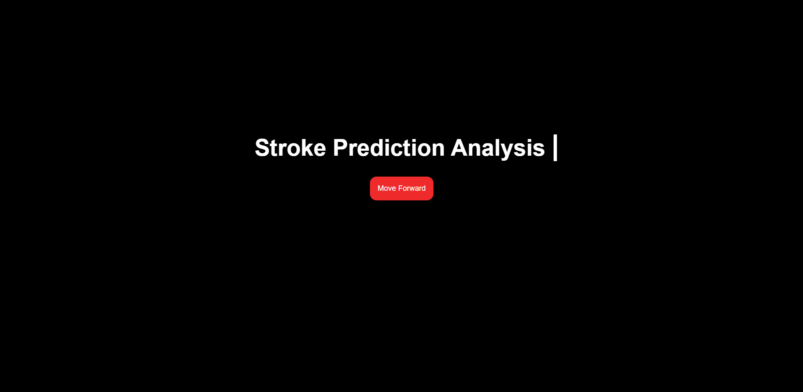
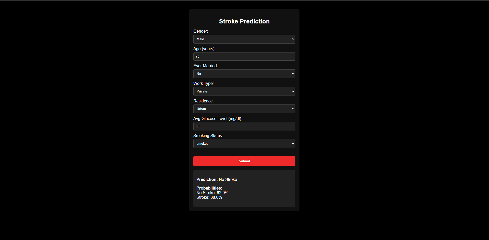

# 🧠 Stroke Prediction Web App

This is a full-stack machine learning web application that predicts the probability of stroke based on user-submitted patient data. It uses a Random Forest classifier trained on a curated healthcare dataset, with consistent preprocessing logic across the frontend, backend, and model training pipeline.

---

## 📁 Project Structure

```
├── frontend/           # Vite + React frontend with input form and results
├── backend/            # Flask API for prediction using trained model and scalers
├── model-training/     # Dataset, preprocessing, training notebooks, and pickle generation
├── screenshots/        # UI screenshots
├── README.md           # Project documentation
```

---


## 📊 Features

- Responsive React frontend for submitting patient data
- Flask backend with `/predict` API route
- Preprocessing consistency ensured using saved LabelEncoders and Scalers
- Model trained with Random Forest on structured health records
- Returns stroke/no-stroke probabilities as output

---

## 📚 Datasets & Training

Training and preprocessing scripts are located in `model-training/`. It contains:

- `healthcare-dataset-stroke-data.csv`: Original dataset
- `final_stroke_dataset.csv`: Transformed and cleaned dataset
- `model_training.ipynb`: Jupyter notebook for encoding, scaling, and training
- Outputs:
  - `rf_model.pkl`
  - `label_encoders.pkl`
  - `cat_scalers.pkl`
  - `scaler_age.pkl`
  - `scaler_glucose.pkl`

---

## 🚀 Getting Started

### 1. Clone the repository
```bash
git clone https://github.com/MianHadihehe/DS.git
cd DS
```

### 2. Set up the backend
```bash
cd backend
pip install -r requirements.txt
python app.py
```

### 3. Set up the frontend
```bash
cd ../frontend
npm install
npm run dev
```

Make sure the backend is running on port `5000`. The frontend will send POST requests to `http://localhost:5000/predict`.

---

## 📸 Screenshots

### Main Page


### Prediction Form


---

## 🙋 Acknowledgments

- Dataset from [Kaggle Stroke Prediction Dataset](https://www.kaggle.com/datasets/fedesoriano/stroke-prediction-dataset)
- React, Flask, scikit-learn, and Python
